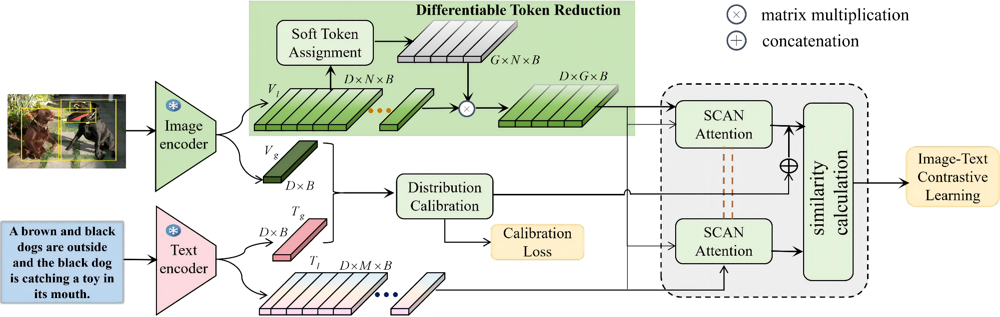
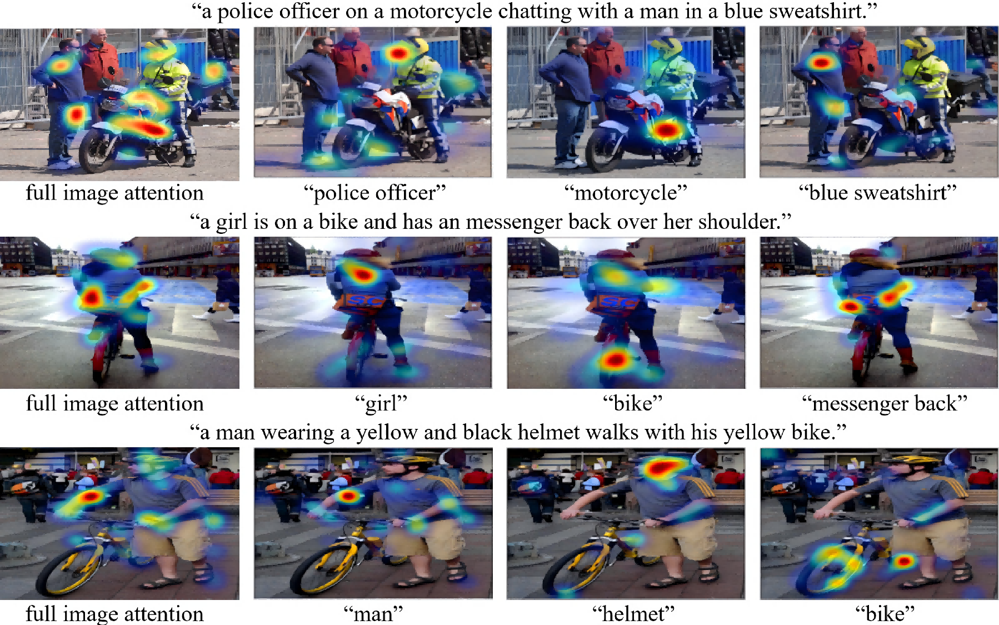

# Calibrate and Aggregate: Cross-Modal Retrieval with Distribution Alignment and Token Reduction

Official PyTorch Implementation of the ICMR 2026 paper:

> **Calibrate and Aggregate: Cross-Modal Retrieval with Distribution Alignment and Token Reduction**  
> [Ziyi Wu](https://github.com/Wuziyi123), [Jiahao Li](https://github.com/Wuziyi123), [Mingyuan Jiu*](mailto:iemyjiu@zzu.edu.cn), [Hongru Zhao](mailto:zhaohongru@zzu.edu.cn), [Hichem Sahbi](mailto:hichem.sahbi@lip6.fr), [Mingliang Xu](mailto:iexumingliang@zzu.edu.cn)  
> Zhengzhou University & CNRS LIP6, Sorbonne University  
> **ICMR 2026** (Amsterdam, Netherlands)  

## 📖 Overview

**DATR** is an end-to-end framework for efficient cross-modal image-text retrieval that addresses two key challenges: the semantic gap between visual and textual modalities, and computational inefficiency caused by redundant visual tokens.

The framework integrates:
- **Distribution Calibration Module (DCM)** — Maps features into a Gaussian latent space via reparameterization and maximizes inter-modal mutual information with InfoNCE loss.
- **Differentiable Token Reduction (DTR)** — Dynamically clusters redundant visual tokens into semantic groups using Gumbel-Softmax soft assignment, reducing computation while preserving semantics.


## Architecture



## 🔧 Installation

### Prerequisites

- Python 3.8+
- NVIDIA GPU with CUDA support
- 24GB+ GPU memory recommended

```bash
git clone https://github.com/Wuziyi123/DATR.git
cd DATR
```

### Dependencies

```bash
pip install torch torchvision
pip install transformers clip timm pywt numpy pandas matplotlib opencv-python tqdm scipy
```

Additional optional dependencies:
```bash
pip install pytorch-lightning wandb  # for logging
```

## 📦 Dataset Setup
Please prepare the Flickr30K and MSCOCO dataset:

1. Images: download `flickr30k-images.tar`
2. Annotations: download `results_20130124.token`
3. RPN proposals: download `flickr30k_rpn_proposals-U.json`

Organize the data:

```
DATR/
└── DATA/
    └── flickr30k/
        ├── flickr30k-images/       # Image files
        ├── results_20130124.token  # Annotations
        └── flickr30k_rpn_proposals-U.json  # RPN proposals
```

### MSCOCO

Follow standard splits for 1K and 5K test sets as in VSE++ / SCAN.

## 🚀 Quick Start

### Training

```bash
python latest.py
```

### Inference

Load a trained checkpoint and run evaluation:

```python
# In latest.py, set checkpoint=True
# and specify your model path
checkpoint = True
model_path = "retriever_epoch_best.pth"  # your checkpoint
```

The script will load the model and run validation, outputting R@1/5/10 for both I2T and T2I retrieval.

## 📊 Results

### Table 1: Flickr30K 1K Test Set Results

| Backbone | I2T R@1 | I2T R@5 | I2T R@10 | T2I R@1 | T2I R@5 | T2I R@10 | RSUM |
|----------|---------|---------|----------|---------|---------|----------|------|
| ViT-B/16 | 86.5 | 98.6 | 99.6 | 74.1 | 95.4 | 97.7 | **551.9** |
| ViT-L/14@336px | 88.6 | — | — | 75.6 | — | — | 560.2 |
| Swin-Base-224 | **89.6** | — | — | **77.2** | — | — | **561.5** |

### Table 2: MSCOCO 1K Test Set Results

| Backbone | I2T R@1 | I2T R@5 | I2T R@10 | T2I R@1 | T2I R@5 | T2I R@10 | RSUM |
|----------|---------|---------|----------|---------|---------|----------|------|
| ViT-B/16 | 86.4 | — | — | 71.1 | — | — | **544.8** |

## 🔬 Visual Grounding




## 📝 Citation

If you use DATR in your research, please cite:

```bibtex
@inproceedings{wu2026datr,
  author    = {Wu, Ziyi and Li, Jiahao and Jiu, Mingyuan and Zhao, Hongru and Sahbi, Hichem and Xu, Mingliang},
  title     = {Calibrate and Aggregate: Cross-Modal Retrieval with Distribution Alignment and Token Reduction},
  booktitle = {Proceedings of the International Conference on Multimedia Retrieval (ICMR)},
  year      = {2026},
  doi       = {10.1145/3805622.3810660}
}

